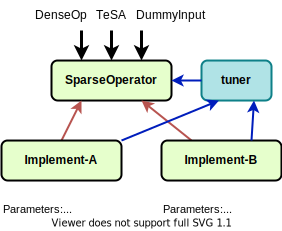

# Code Specializer

SparTA code specializer helps users to generate efficient executable codes for specific operators and their given sparsity TeSA (i.e., pruning mask).

To balance between the flexibility, performance, and developing efficiency, we adopt a *tunable* hierachical achitecture for the code specializer (as below). 

<!--

-->

| Layer | Base Class | Role |
| :- | :- | :- |
| Sparse Operator | [`sparta.nn.OperatorBase`](reference/nn.rst) | User interface as `torch.nn.Module` |
| Sparse Context | `sparta.specializer.funtional.SparseCtxBase` | Function context to interact with `torch.autograd.Function` |
| Sparse Kernel Placeholder | `sparta.specializer.funtional.KernelPlaceholder` | Collection of multiple kernel implementations |
| Sparse Kernel | `sparta.specializer.kernels.KernelBase` | Tunable sparse CUDA kernel interface |

## Generating CUDA Codes

Each sparse kernel acts as a CUDA code generator in the building stage. Only template-based methods is supported now.

### [Jinja2](http://docs.jinkan.org/docs/jinja2/) Templates

We collected multiple CUDA kernel template files in `sparta/specializer/kernels/templates/`.

| Kernel Name | File Name |
| :- | :- |
| SparTA Block Sparse MatMul | `sparta_sparse_matmul_*.cuh.j2` |
| OpenAI Block Sparse MatMul | `openai_sparse_matmul_*.cuh.j2` |
| SparTA Block Sparse Softmax Forward | `sparta_sparse_softmax_forward.cuh.j2` |
| SparTA Block Sparse Softmax Backward | `sparta_sparse_softmax_backward.cuh.j2` |

## Binding to PyTorch 

SparTA applies [PyCuda](https://documen.tician.de/pycuda/) to compile implement and load the cooresponding operator to deep learning framework (now only `PyTorch` supported). 
